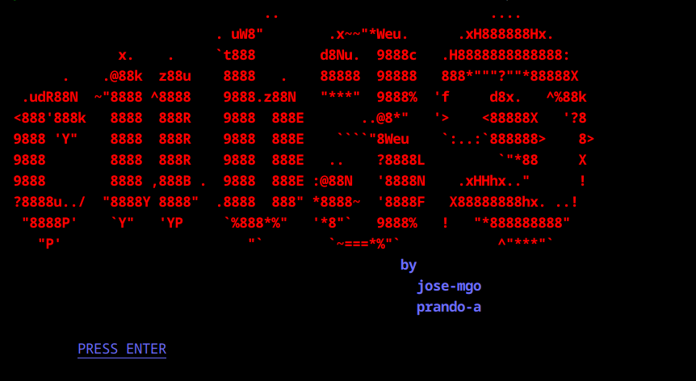
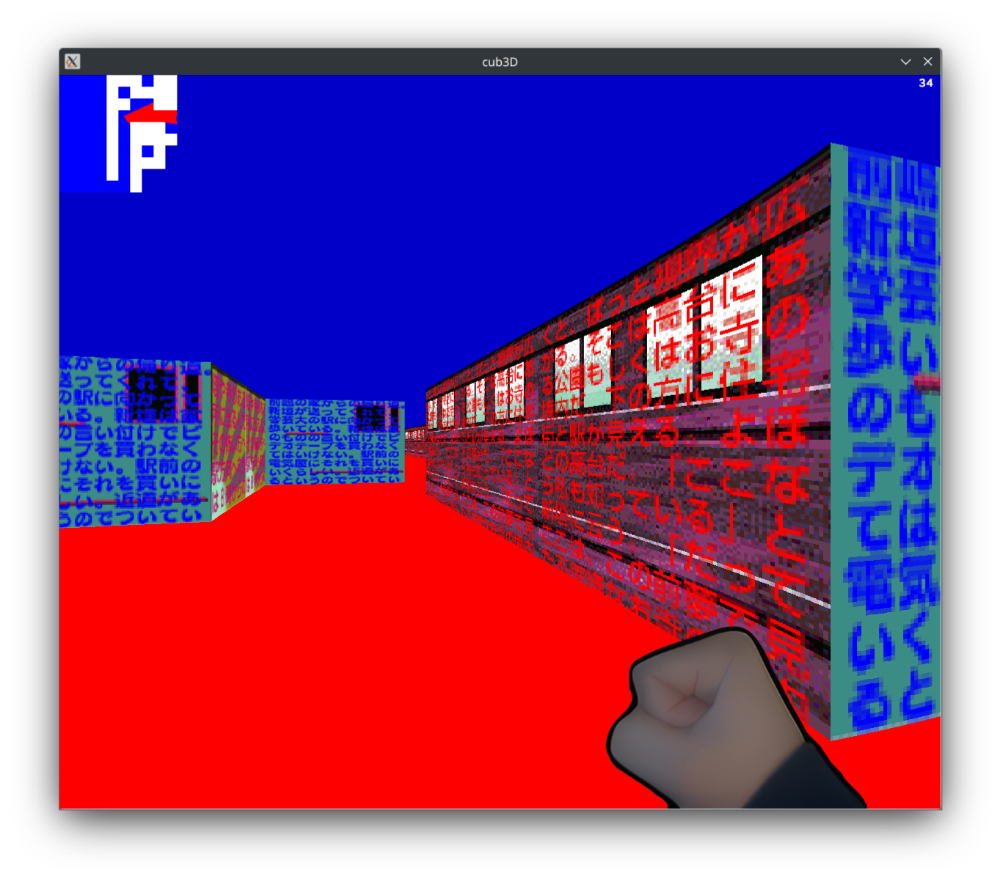
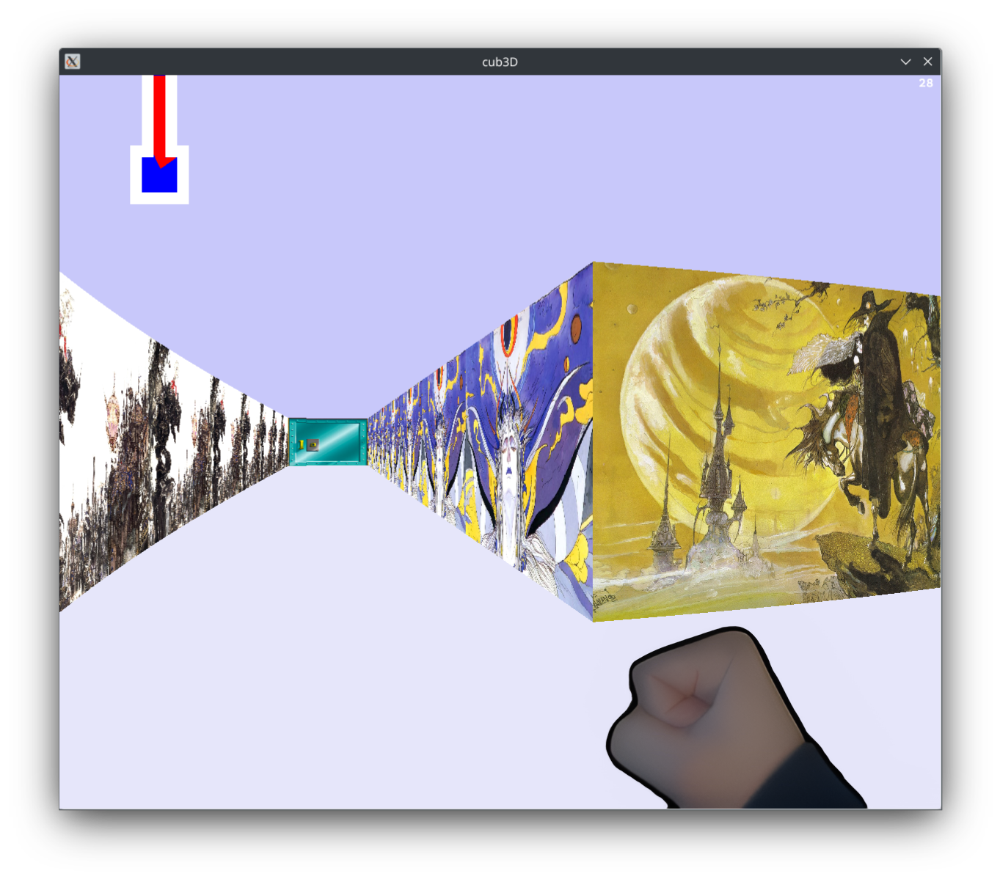
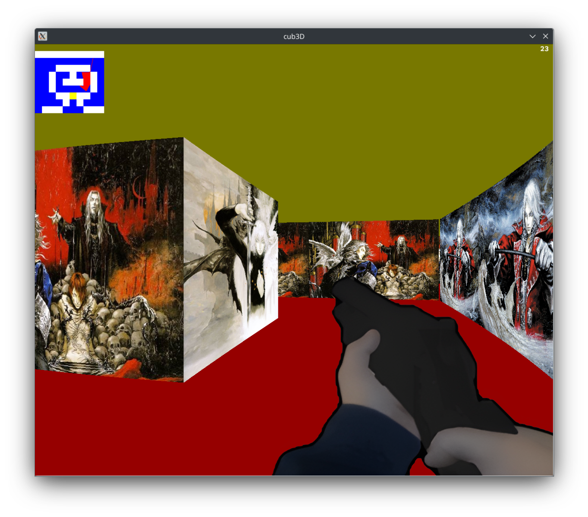

# cub3d





---
### Description

The **cub3d** project is a basic 3D game inspired by Wolfenstein 3D, where the player navigates through a maze-like map using raycasting to simulate 3D rendering. This project serves as an introduction to graphics programming, user interaction, and game development. 

The project is built using the [**MLX42**](https://github.com/codam-coding-college/MLX42) library, a modern implementation of the classic MinilibX, which requires **GLFW** to be installed on your system. On Linux, it can be installed with the following command:
```bash
sudo apt-get install libglfw3-dev
```

Through this project, the following skills can be acquired:
- **Raycasting**: Simulating 3D environments in a 2D plane.
- **Graphics Programming**: Rendering walls, textures, and sprites in real-time.
- **Input Handling**: Managing keyboard and mouse inputs for player interaction.
- **Memory Management**: Loading and managing assets and ensuring proper cleanup.

---
### Features

#### Mandatory Version

1. Basic raycasting for 3D visualization.
2. Wall collision detection to restrict player movement.
3. Maps are loaded from `.cub` files.
4. Textures and colors are defined for walls, floor, and ceiling.
5. Simple keyboard controls for movement and rotation.

#### Bonus Version

1. **Minimap**:
   - Displays the map layout and tracks the player’s position in real-time.

2. **Weapons** (to fullfill the animation requirement to earn evaluation bonus score):
   - Three weapons: fist, pistol, and shotgun.
   - Switch weapons using the `1`, `2`, and `3` keys.
   - Use the **right mouse button** to attack (punch/shoot).

3. **Player Movement**:
   - Sprinting is enabled by holding the `Shift` key, doubling the player’s movement speed.

4. **Camera Control**:
   - Rotate the camera with the mouse.
   - Adjust camera sensitivity by scrolling the mouse wheel up (increase sensitivity) or down (decrease sensitivity).

5. **Doors**:
   - Interactive doors can be opened by pressing a designated key (based on this, we designed a shoot/punch action).

---
### Map design

A map consists of three elements:

- **Paths to texture files**:  
  Each map must define the paths to the `.png` files used as textures for walls, doors, and any sprites included in the game. These paths should be declared at the beginning of the map file and must correspond to valid files in the project directory. The textures will be mapped to the surfaces in the game environment during rendering.

- **Colors for the ceiling and floor**:  
  The ceiling and floor colors must be specified in RGB format, where each color component is an integer between 0 and 255, separated by commas. These colors define the flat shading of the ceiling and floor in the game.

- **The map layout**:  
The layout defines the playable area and is represented using specific characters:  
- `1`: Represents walls, which are impassable obstacles.  
- `0`: Represents empty spaces where the player can move.  
- `N`, `S`, `E`, `W`: Marks the player’s starting position and initial orientation (North, South, East, or West).  
- `D`: Represents doors (if bonus version is compiled).


#### Example of a Valid Map

The following map is completely correct and good to be readen by the program:

    NO   ./sprites/01/NO.png
    SO   ./sprites/01/SO.png
    WE   ./sprites/01/WE.png
    EA   ./sprites/01/EA.png

    F 30,30,25
    C 40,10,50
    111111111111111111111111111111111111111111111111111111111111
    101011111000001110111000111110000111111111111111100111111111
    100000000101101110011011111001111111111111111111101111111111
    1011011101011010001010000000W0111111111111111111000011111111
    101101000001101011111011111001011111111111111111011011111111
    110001010110001000000011001110000111111110000000000111111111
    110111011001110011111010111001011111111111101111111111111111
    100100011100000101011000110111000001111111101111111111111111
    110001001101011100011011110111111101111111101111111111111111
    101101100000010101011110011100000D00000000001111111111111111
    1000011011110000010001111000011101100010001D1111111111111111
    111011101011101111010000111111111111111111101111111111111111
    100111000000101110101110000000000000000001101111111111111111
    101010011101101100100111101111111111111101101111111111111101
    110100110101101010110000001101000011100000001111111111100101
    100111000001100000001111100000111001101101111111111111101101
    111001011110001011101111001100000011101100000000000000000001
    111111111111111111111111111111111111111111111111111111111111

#### Map design rules

A valid map can considered as such by the following rules:

* It has to be completely closed, this means every 0 will not lead to a blank space, just a 1, D (in bonus case) or any player position character.
* There must be one an only one player position character (N, S, W or E) on the map.
* Only the characters mentioned in the two points above are allowed to use within a map.
* Map rules can be written in any order before and/or after the map, as the program can parse it perfectly.
* A door must be bordered by walls (1) on opposite sides (east-west or north-south) and floor (0) on the other two sides. This means in the logic of a rendered map no door must lead to a wall, cannot be accessed from anywhere, or cannot be not attached to only two walls.
* A space must not be treated as floor, so they must not remain among a floor character.
* Floor and ceil colors must not be the same. Color codes can only use values from 0 to 255, separated by commas.
* Path to assets must be correct, and they must be in PNG format.
* Map text filenames must end in .cub

See the available [map directory](https://github.com/prando-a/42Cursus/tree/master/cub3D/maps) included on project to watch more valid examples.

---
### Usage

This program is compiled with a Makefile located in the pipex directory. Type `make` or `make all` to compile the regular version or `make bonus` to compile the bonus version. <br>

Then, in both cases, a `cub3d` executable will be generated. Execution is as follows:

  ```bash
  ./cub3d [map_file]
  ```
If map was successfully proccesed, it is prompted to press `Enter` load the assets and play. Press `ESC` to cleanly exit anytime.

#### Controls

Full list of controls with a loaded map:

##### Mandatory Version
- **Move Forward**: `W`
- **Move Backward**: `S`
- **Move Left**: `A`
- **Move Right**: `D`
- **Rotate Left**: Left Arrow
- **Rotate Right**: Right Arrow
- **Exit the Game**: `ESC`

##### Bonus Version (Additional Controls)
- **Sprint**: Hold `Shift` to increase movement speed (double the normal speed).
- **Switch Weapons**:
  - `1`: Fist
  - `2`: Pistol
  - `3`: Shotgun
- **Attack**: Right Mouse Button (either punch or shoot depending on the equipped weapon).
- **Adjust Camera Sensitivity**: 
  - Scroll Wheel Up: Increase camera sensitivity.
  - Scroll Wheel Down: Decrease camera sensitivity.
