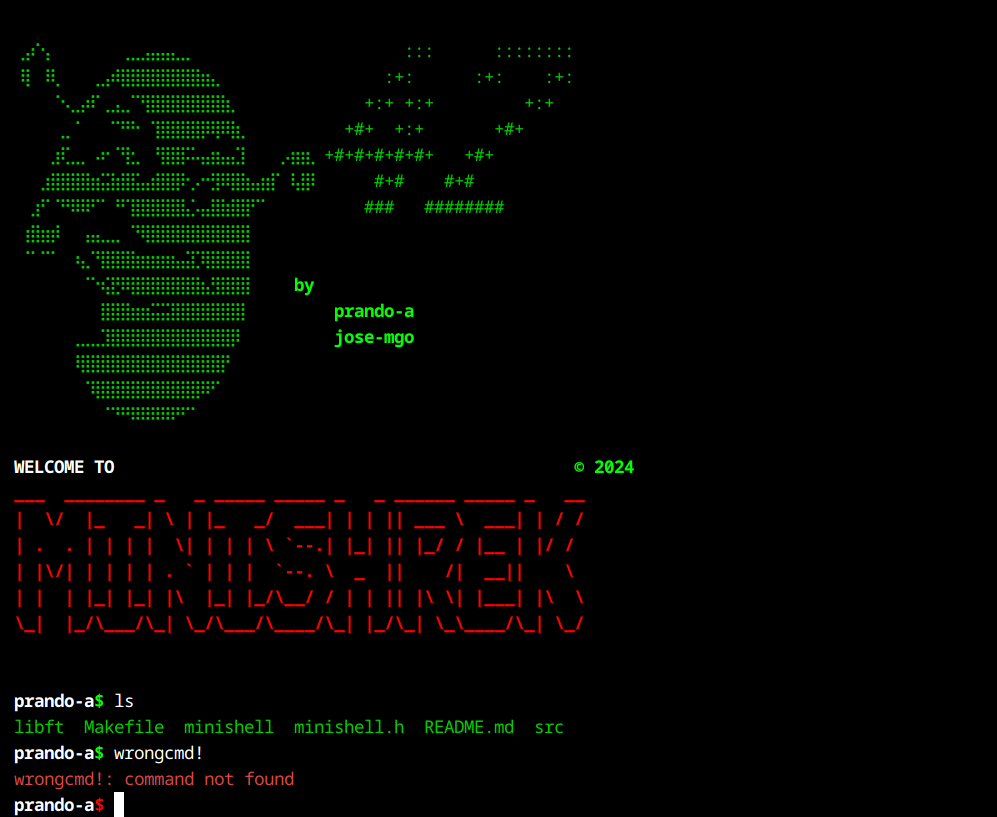

# minishell



### Description

The objective of this project is to create a simple shell, mimicking some of the behaviors and functionalities of a real shell like `bash`. Through this project, you will learn:
- **Process management**: Using `fork()` and `execve()` to execute commands.
- **Signal handling**: Implementing basic signals (`SIGINT`, `SIGQUIT`) for interactive shell behavior.
- **Parsing**: Tokenizing and interpreting user input to execute commands.
- **Redirection and Pipes**: Handling input/output redirection and piping between commands.

The goal is to gain a deeper understanding of how shells function and interact with the operating system.

### Prerequisites

Before running the project, ensure that the `readline` library is installed on your system. Use the following commands to install it:

- On Debian-based systems (e.g., Ubuntu):
  ```bash
  sudo apt-get install libreadline-dev
  ```

- On Red Hat-based systems (e.g., Fedora):
  ```bash
  sudo dnf install readline-devel
  ```

- On macOS (with Homebrew):
  ```bash
  brew install readline
  ```

### Usage

This program is compiled with a Makefile located in the minishell directory. Type `make` or `make all` to compile the project. <br>

Once compiled, a `minishell` executable will be generated. Execution is as follows:

```bash
./minishell
```

Minishell will display a prompt waiting for user input.
The prompt will also display the user name. And the $ symbol at the end will change color based on the exit status of the last command executed:

  -  The $ will appear in green if the exit status is 0 (indicating success).
  -  The $ will appear in red if the exit status is non-zero (indicating an error).

### Examples of Execution

1. **Running a basic command**:
   ```bash
   ls -la
   ```
   Executes the `ls` command with the `-la` flags.

2. **Using pipes**:
   ```bash
   ls -1 | grep "file"
   ```
   Lists files in the current directory and filters those containing the word "file".

3. **Redirection**:
   - **Output redirection**:
     ```bash
     echo "Hello, World!" > file.txt
     ```
     Writes the output of `echo` to `file.txt`.
   - **Input redirection**:
     ```bash
     cat < file.txt
     ```
     Reads the content of `file.txt` and displays it.
   - **Append redirection**:
     ```bash
     echo "Additional line" >> file.txt
     ```
     Appends a new line to `file.txt`.

4. **Environment variables**:
   ```bash
   echo $HOME
   ```
   Displays the value of the `HOME` environment variable.

5. **Built-in commands (made from scratch with pure C)**:
   - **Change directory**:
     ```bash
     cd /path/to/directory
     ```
   - **Display current directory**:
     ```bash
     pwd
     ```
   - **Print text to standard output**:
     ```bash
     echo [text]
     ```
     Options like `-n` can be used to suppress the trailing newline.
   - **Export a variable to the environment**:
     ```bash
     export VAR_NAME=value
     ```
     Adds or updates environment variables.
   - **Unset an environment variable**:
     ```bash
     unset VAR_NAME
     ```
     Removes a variable from the environment.
   - **Display a list of environment variables**:
     ```bash
     env
     ```
   - **Exit the shell**:
     ```bash
     exit [status]
     ```
     Ends the shell session. Optionally, an exit status can be provided.


### Additional Features

* Some environment variables managements
  - SHELL is set up as `minishell`
  - SHLVL raises its count every instance of minishell executed
  - If PATH is missing, it can be set up again by using the `export` built-in
  - In prompt, if the USER variable to display is missing, LOGNAME will be used or `minishell` if neither available.
* Heredoc is fully parsed and tokenized.
* If multiple input/output files are stated on a command, the very last one will be used.
